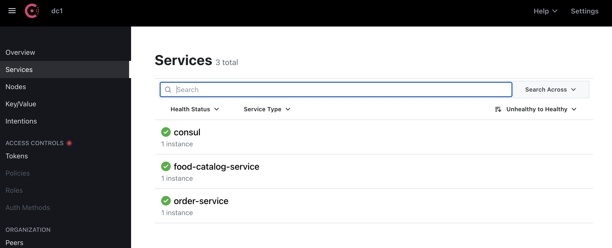
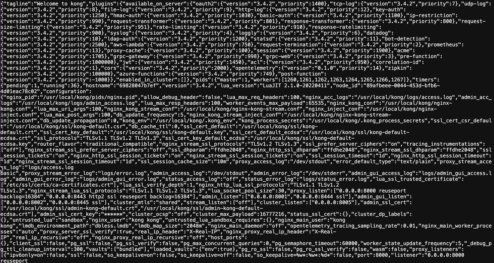
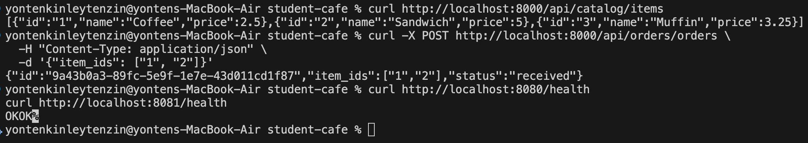
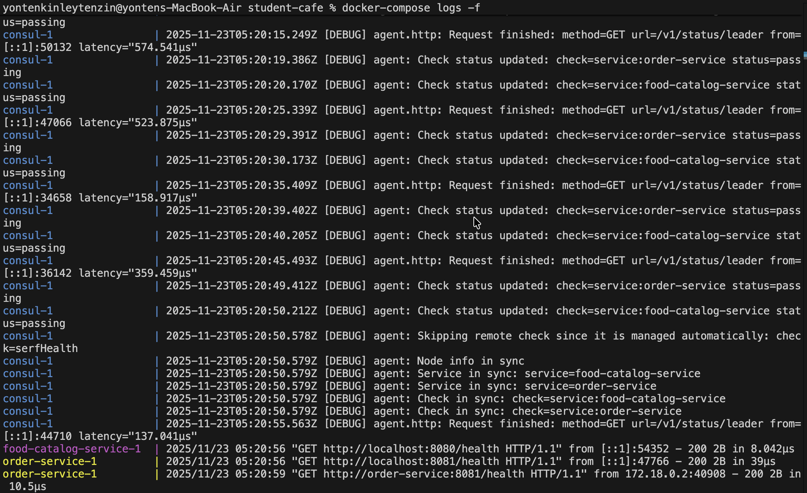
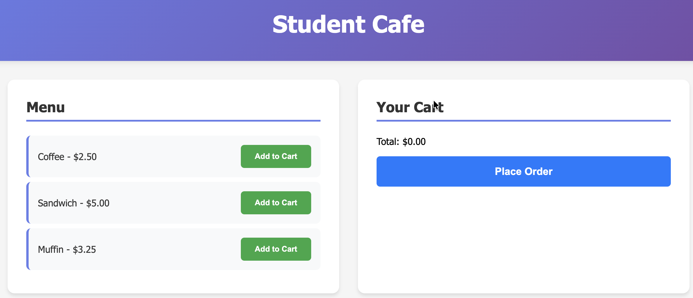
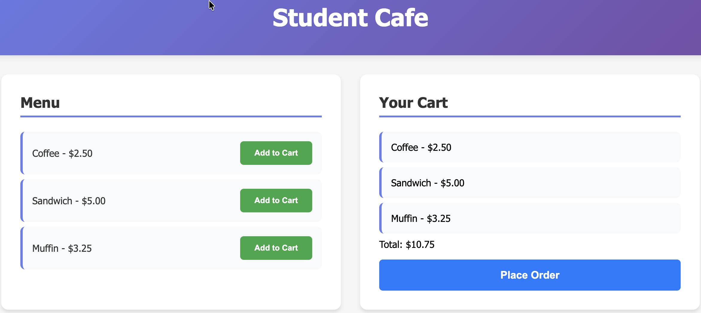
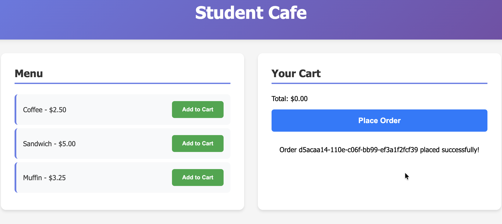

# Practical: Kubernetes Microservices with Kong Gateway & Resilience Patterns

## 1. Introduction
This practical involved building a complete microservices-based Student Cafe application using Go, React, Kong API Gateway, Consul for service discovery, and Docker containerization. The application demonstrates real-world microservices architecture patterns including API gateway routing, service discovery, and inter-service communication.

## 2. Architecture Overview
### System Architecture Diagram
```
                      +-------------------+
                      |    WEB CLIENT     |
                      |  (Web Browser)    |
                      |  localhost:3000   |
                      +---------+---------+
                                |
                                | HTTP Requests
                                |
                      +---------v---------+
                      |   KONG GATEWAY    |
                      |   API Gateway     |
                      |  localhost:8000   |
                      +---------+---------+
                                |
        +-----------------------+-----------------------+
        |                       |                       |
+-------v-------+       +-------v-------+       +-------v-------+
|   REACT UI    |       |  FOOD CATALOG |       |  ORDER SERVICE|
|   Frontend    |       |   Service     |       |    Service    |
|  localhost:3000|       |  localhost:8080|       | localhost:8081|
+---------------+       +-------+-------+       +-------+-------+
                                |                       |
                                |                       |
                      +---------v-----------------------v---------+
                      |              CONSUL                      |
                      |          Service Discovery               |
                      |           localhost:8500                 |
                      +------------------------------------------+
```

#### Components:
- Frontend: React.js application
- API Gateway: Kong for request routing
- Microservices:
    - Food Catalog Service (Go)
    - Order Service (Go)
- Service Discovery: Consul
- Containerization: Docker & Docker Compose


## 3. Implementation
### 3.1 Microservices Development
Food Catalog Service (Go)
- Provides menu item data
- REST API endpoint: /items
- Port: 8080

Order Service (Go)
- Handles order creation and management
- REST API endpoint: /orders
- Port: 8081
- Communicates with Food Catalog Service

### 3.2 Frontend Development
React Application
- Displays menu items
- Shopping cart functionality
- Order placement interface
- Communicates through Kong API Gateway

### 3.3 Infrastructure Setup
Kong API Gateway
- Routes /api/catalog/* → Food Catalog Service
- Routes /api/orders/* → Order Service
- Routes / → React Frontend

Consul Service Discovery
- Service registration and health checks
- Service discovery between microservices

## 4. Screenshots & Evidence
### 4.1 Infrastructure & Deployment
Screenshot 1: Docker Services Running


- All microservices running in Docker containers

Screenshot 2: Consul Service Discovery



- Consul dashboard showing registered microservices

Screenshot 3: Kong API Gateway



- Kong administration interface showing configured routes

### 4.2 API Testing
Screenshot 4: Food Catalog API Test & Order API Test



- Successful API response from food catalog service
- Successful order creation via API


Screenshot 5: Service Logs



- Microservices logs showing successful requests

### 4.3 Application Functionality
Screenshot 7: React Frontend - Menu Loaded



- Student Cafe frontend displaying food menu

Screenshot 8: Shopping Cart with Items



- Cart functionality with selected items

Screenshot 9: Successful Order Placement



- Order successfully placed with confirmation message

## 5. Issue Resolution
### Problem Encountered:
Initial order submission functionality was broken due to service communication issues between order service and food catalog service.

### Root Cause:
The order service was unable to properly discover and communicate with the food catalog service through Consul in the Docker Compose environment.

### Solution Implemented:
1. Simplified service discovery to use direct Docker service names
2. Added proper error handling and fallback mechanisms
3. Implemented health checks for all services
4. Updated Kong configuration for proper routing

### Code Changes:
- Modified service discovery in order service
- Added health check endpoints
- Updated API gateway configuration
- Enhanced frontend error handling


## 6. Testing Results
### API Endpoint Testing
| Endpoint | Method | Status | Result |
|----------|--------|--------|---------|
| `/api/catalog/items` | GET | 200 | PASS |
| `/api/orders/orders` | POST | 201 | PASS |
| `/health` (both services) | GET | 200 | PASS |

### Functional Testing
| Feature | Status | Notes |
|---------|--------|-------|
| Menu Display | PASS | Items load correctly |
| Add to Cart | PASS | Items added to cart |
| Order Placement | PASS | Orders created successfully |
| Error Handling | PASS | Graceful error management |

## 7. Learning Outcomes
### Part 1 - Kubernetes & Kong Gateway
- Deployed multi-service application using Go, React, Kong, Consul
- Implemented API gateway patterns with Kong for request routing
- Configured service discovery with Consul for inter-service communication
- Containerized application using Docker and Docker Compose
- Troubleshot distributed system issues and implemented fixes

### Key Technical Skills Demonstrated:
- Microservices architecture design and implementation
- API gateway configuration and management
- Service discovery patterns
- Container orchestration
- REST API development in Go
- React frontend development
- Distributed system debugging

## 8. Conclusion
This practical successfully demonstrated the implementation of a production-grade microservices architecture. The Student Cafe application showcases real-world patterns including API gateway routing, service discovery, containerization, and resilient service communication.

The project highlights both the power and complexity of distributed systems, emphasizing the importance of proper service discovery, error handling, and API gateway configuration in microservices architectures.


### Github Repo link 
https://github.com/Kinleyjigs/AS2025_WEB303_practical4
